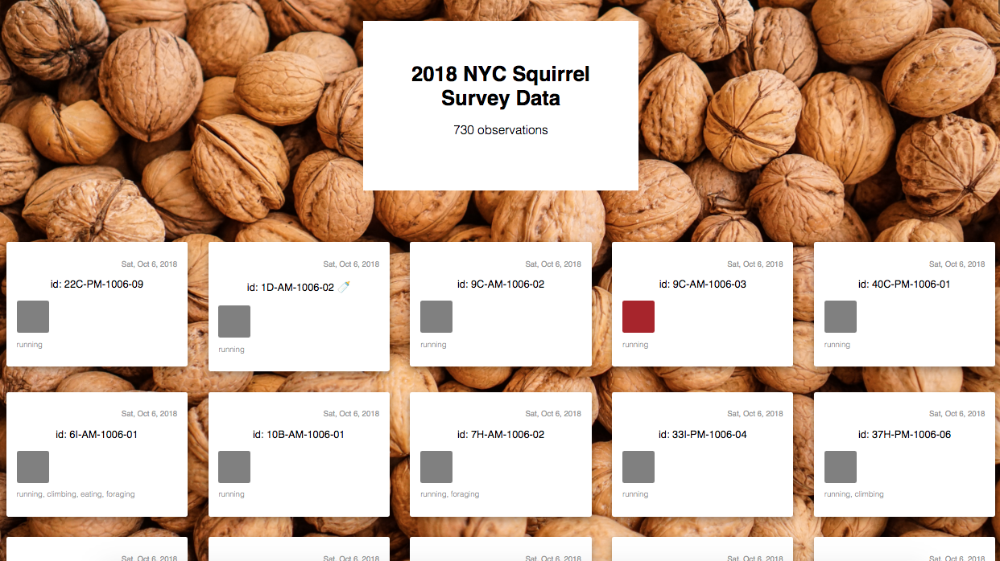

# Lab: Displaying NYC Open Data

## The Goal

In this lab, you'll build an interface to display NYC Open Data.

## The Setup

1. Clone this repository using `git clone`
2. `cd` into the project folder
3. `npm install`
4. `npm start`

## The Lab

### Part Zero: Sign up for a Socrata API Token

1. Follow the instructions in the "Getting an App Token" section of the ["NYC Open Data" lesson](https://github.com/upperlinecode/CS-and-the-City-Curriculum/blob/master/react/react-nyc-open-data.md#getting-an-app-token).

### Part One: 🐿

1. Use the [NYC Open Data Portal](https://opendata.cityofnewyork.us/) to locate the "2018 Central Park Squirrel Census - Squirrel Data" dataset.
2. Consult the API Documentation, and open the API endpoint (the URL ending in `.json`) in a new tab.
3. Create a new Socrata App Token and append it to the end of the URL.
> Refer back to the ["Getting an App Token" section of the NYC Open Data lesson](https://github.com/upperlinecode/CS-and-the-City-Curriculum/blob/master/react/react-nyc-open-data.md#getting-an-app-token) if you need help with this.
4. Filter the data to only those squirrels who were viewed while running: `running=true`.
> Refer back to the ["Filtering Data from Socrata" section of the NYC Open Data lesson](https://github.com/upperlinecode/CS-and-the-City-Curriculum/blob/master/react/react-nyc-open-data.md#filtering-data-from-socrata) if you need help with this.

### Part Two: 🐿 in React

> Refer back to the ["Getting NYC Open Data into React" section of the NYC Open Data lesson](https://github.com/upperlinecode/CS-and-the-City-Curriculum/blob/master/react/react-nyc-open-data.md#getting-nyc-open-data-into-react) if you need help with this.

1. Update the functional component `App` in `App.js` to include a `componentDidMount` lifecycle method.
2. Use `fetch()` to get the data from Part One, Step 4. `console.log()` the result.
> Hint: you may need to use an initial `.then()` step to convert the response to JSON.
3. Store the result of the API call in a state variable called `squirrels`.
4. Use `.map()` to render a list of all observed squirrels showing the `unique_squirrel_id` of each.
> Tip: When you `npm run`, your list should have about 700 entries in it. What happens if you remove `running=true` from your API request?
5. Create a new component called `<Squirrel />` and pass its data to it as a prop.
> Note: there's a `.Squirrel` CSS class which may be helpful.

### Part Three: 🌰+🐿 in React

1. Add a note below the `<h1>` indicating how many observations are in the dataset.
2. Add an indicator, e.g. a 🍼, to any data block representing a "Juvenile" squirrel.
2. Add an indication of the fur color to each data block. (e.g. as a circle, square, or background color)
   1. Notice that there are several fields related to squirrel color. Choose the one(s) you think will work best.
3. Show an indicator of at least 4 of the following properties in each data block:
   - "running", "chasing", "climbing", "eating", "foraging", "kuks", "quaas", "moans", "tail_flags", "tail_twitches", "approaches", "indifferent", "runs_from"
   - Only show an indicator if the value of the property is `true`.
4. Display the date of each observation on the data block.
   - Try to reformat the string to show the date as "Wed. Oct. 10, 2018".

### Part Four: 🌳🐿🌳 in React (Stretch)

1. Display the data blocks in order from oldest to newest.
2. Add a button at the top of the app that sorts the data by `primary_fur_color` or another data property.
3. Use the `x` and `y` values to display a map of the location where the squirrel was spotted.
